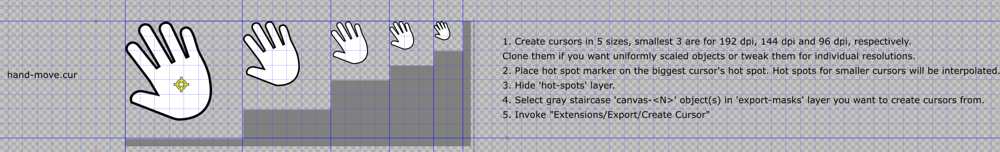

# PngToCursor
Inkscape extension for creating Windows cursors.

Copy content of the InkscapeExtension folder into Inkscape's plug-ins directory (C:\Program Files\Inkscape\share\extensions).
Start Inkscape and use provided CursorTemplate.svg file as a canvas for creating cursors. Extension uses objects from the template file to identify areas to render and calculate cursors hot spot locations.

Next follow the steps:

1. Create cursors in 5 sizes, smallest three are for 192 dpi, 144 dpi and 96 dpi, respectively. Clone them if you want uniformly scaled objects or tweak them for individual resolutions to make them pixel perfect.
2. Place hot spot marker on the biggest cursor's hot spot. Hot spots for smaller cursors will be interpolated.
3. Hide 'hot-spots' layer.
4. Select gray staircase 'canvas-N' object(s) in 'export-masks' layer you want to create cursors from.
5. Name cursor files (text boxes 'cursor-N.cur').
6. Invoke "Extensions/Export/Create Cursor" and provide destination path.

Known problems:
Cursor extension invokes Inkscape to export PNG. This process has tendency to hang. When that happens, kill it in the Task Manager.

Example cursor image in Inkscape with hot spot marker visible:

